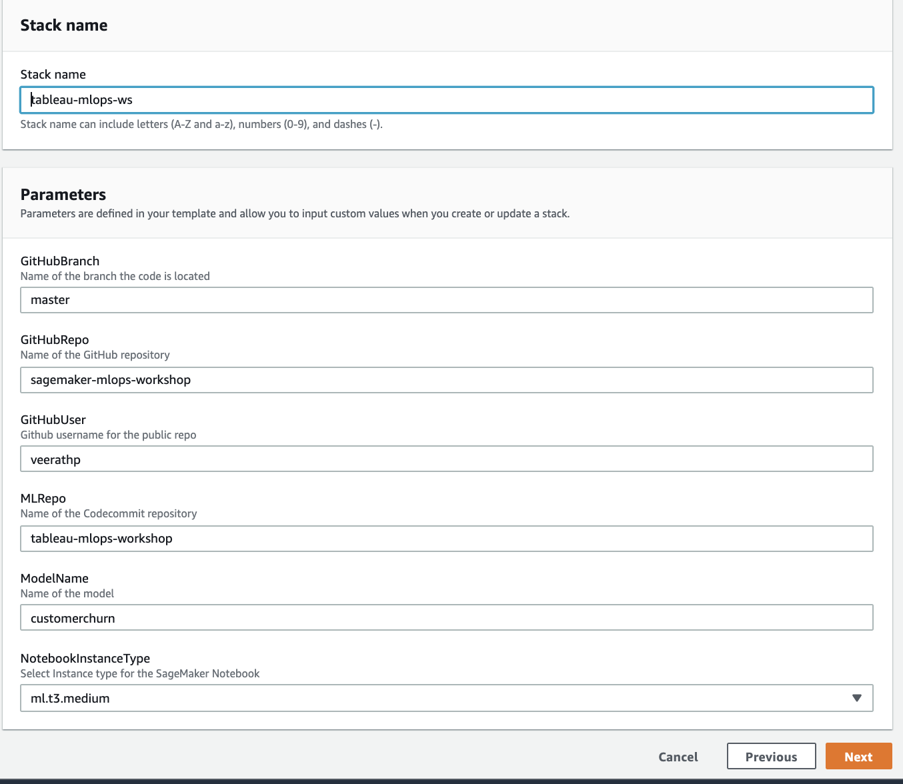

# Tableau Amazon SageMaker MLOps Workshop 

[Reference: https://github.com/aws-samples/amazon-sagemaker-safe-deployment-pipeline.git]

## Introduction

In this lab, we will build a deoloyment pipeline for Amazon SageMaker.  This example could be useful for any organization looking to operationalize machine learning with native AWS development tools such as AWS Code Commit, CodePipeline, CodeBuild and  CodeDeploy.

This solution provides deployment by creating an AWS Lambda API that calls into an Amazon SageMaker Endpoint for real-time inference.

##  Architecture

Following is a diagram of the continuous delivery stages in the AWS Code Pipeline.

1. Build Artifacts: Runs a AWS CodeBuild job to create AWS CloudFormation templates.
2. Train: Trains an Amazon SageMaker pipeline and Baseline Processing Job
3. Deploy Dev: Deploys a development Amazon SageMaker Endpoint
4. Deploy Prod: Deploys an AWS API Gateway Lambda in front of Amazon SageMaker Endpoints using AWS CodeDeploy for blue/green deployment and rollback.


###  Components Details

  - [**AWS SageMaker**](https://aws.amazon.com/sagemaker/) – This solution uses SageMaker to train the model to be used and host the model at an endpoint, where it can be accessed via HTTP 
   - [**AWS CodeCommit**](https://aws.amazon.com/codecommit/) – 
  AWS CodeCommit is a fully-managed source control service that hosts secure Git-based repositories. This solution uses CodeCommit as the source repository
  - [**AWS CodePipeline**](https://aws.amazon.com/codepipeline/) – CodePipeline has various stages defined in CloudFormation which step through which actions must be taken in which order to go from source code to creation of the production endpoint.
  - [**AWS CodeBuild**](https://aws.amazon.com/codebuild/) – This solution uses CodeBuild to build the source code from AWS CodeCommit Repository
  - [**AWS CloudFormation**](https://aws.amazon.com/cloudformation/) – This solution uses the CloudFormation Template language, in either YAML or JSON, to create each resource including custom resource.
  - [**AWS S3**](https://aws.amazon.com/s3/) – Artifacts created throughout the pipeline as well as the data for the model is stored in an Simple Storage Service (S3) Bucket.

## Deployment Steps

Following is the list of steps required to get up and running with the MLOps pipeline.

###  Prepare an AWS Account

To sign in to the AWS console, paste the hash login URL associated to your name in a browser and click “AWS Console”, then “Open AWS Console”

###  Launch the AWS CloudFormation Stack

Click on the **Launch Stack** button below to launch the CloudFormation Stack to set up the SageMaker MLOps pipeline.

[](https://us-west-2.console.aws.amazon.com/cloudformation/home?region=us-west-2#/stacks/quickcreate?templateUrl=https%3A%2F%2F{S3URLReplace}%2Fpipeline.yml&stackName=tableau-mlops-ws&param_GitHubBranch=master&param_GitHubRepo=sagemaker-mlops-workshop&param_GitHubUser=veerathp&param_MLRepo==tableau-mlops-workshop&param_ModelName=customerchurn&param_NotebookInstanceType=ml.t3.medium
)

Parameters | Description
----------- | -----------
Model Name | A unique name for this model (must less then 15 characters long).
Notebook Instance Type | The [Amazon SageMaker instance type](https://aws.amazon.com/sagemaker/pricing/instance-types/). Default is ml.t3.medium
GitHub Repository | The name (not URL) of the public GitHub repository to pull the base code from.
GitHub Branch | The name (not URL) of the GitHub repository’s branch to use.
GitHub Username | GitHub Username for this repository.  Update this if you have Forked the repository.
MLRepo | The name to be used for the AWS CodeCommit repository.  



###  Start, Test and Approve the Deployment

Once the deployment has completed, there will be a new AWS CodePipeline created linked to your GitHub source.  You will notice initially that it will be in a *Failed* state as it is waiting on an S3 data source.


Open the`sagemaker-mlops.ipynb` notebook in the SageMaker notebook instance. (You can access the Jupter inteface either using Open Jupyter link or Open JupyterLab link). Select the Kernel as "conda_python3" 


Once the notebook is running, you will be guided through a series of steps starting with an ETL step using AWS Glue and uploading the customer churn dataset to an Amazon SageMaker S3 bucket along with the data source meta data to trigger a new build in the AWS CodePipeline. 


Once your pipeline is kicked off, it will run the model training and deploy a development endpoint in SageMaker.  

There is a manual approval step which you can approve directly within the SageMaker Notebook to promote the endpoint to production, send some traffic to the live endpoint and create a REST API.


Subsequent deployments of the pipeline will use AWS CodeDeploy to perform a blue/green deployment to shift traffic from the Original to the new endpoint over a period of 5 minutes.


Finally, the SageMaker Notebook provides the ability to retrieve the results from the Monitoring Schedule that is run on the hour.

###  Approximate Times:

Following is a list of approximate running times for the pipeline

* Full Pipeline: 30 minutes
* Start Build: 2 Minutes
* Model Training and Baseline: 5 Minutes
* Launch Dev Endpoint: 10 minutes
* Launch Prod Endpoint: 15 minutes
* Monitoring Schedule: Runs on the hour

## Customizing for your own model

This solution is written in Python, and designed to be customized for your own model and API.

```
.
├── api
│   ├── __init__.py
│   ├── app.py
│   ├── post_traffic_hook.py
│   └── pre_traffic_hook.py
├── model
│   ├── buildspec.yml
│   ├── requirements.txt
│   └── run.py
|
|── sagemaker-mlops.ipynb
│ 
└── pipeline.yml

```

Edit the `get_training_params` method in the `model/run.py` script that is run as part of the AWS CodeBuild step to add your own estimator or model definition.

Extend the AWS Lambda hooks in `api/pre_traffic_hook.py` and `api/post_traffic_hook.py` to add your own validation or inference against the deployed Amazon SageMaker endpoints.  Also you can edit the `api/app.py` lambda to add any enrichment or transformation to the request/response payload.

## Running Costs

This section outlines cost considerations for running the SageMaker MLOps Deployment Pipeline.  Completing the pipeline will deploy development and production SageMaker endpoints which will cost less than $10 per day. Further cost breakdowns are below.

- **CodeBuild** – Charges per minute used. First 100 minutes each month come at no charge. For information on pricing beyond the first 100 minutes, see [AWS CodeBuild Pricing](https://aws.amazon.com/codebuild/pricing/).
- **CodeCommit** – $1/month 
- **CodeDeploy** – No cost with AWS Lambda.
- **CodePipeline** – CodePipeline costs $1 per active pipeline* per month. Pipelines are free for the first 30 days after creation. More can be found at [AWS CodePipeline Pricing](https://aws.amazon.com/codepipeline/pricing/).
- **CloudWatch** - This template includes a [Canary](https://docs.aws.amazon.com/AmazonCloudWatch/latest/monitoring/CloudWatch_Synthetics_Canaries.html), 1 dashboard and 4 alarms (2 for deployment, 1 for model drift and 1 for canary) which costs less than $10 per month.
  - Canaries cost $0.0012 per run, or $5/month if they run every 10 minutes.
  - Dashboards cost $3/month.
  - Alarm metrics cost $0.10 per alarm.
- **KMS** – $1/month for the key created.
- **Lambda** - Low cost, $0.20 per 1 million request see [Amazon Lambda Pricing](https://aws.amazon.com/lambda/pricing/)
- **SageMaker** – Prices vary based on EC2 instance usage for the Notebook Instances, Studio, Model Hosting, Model Training and Model Monitoring; each charged per hour of use. For more information, see [Amazon SageMaker Pricing](https://aws.amazon.com/sagemaker/pricing/).
  - The `ml.t3.medium` instance *notebook* costs $0.0582 an hour.
  - The `ml.m4.xlarge` instance for the *training* job costs $0.28 an hour.
  - The `ml.m5.xlarge` instance for the *monitoring* baseline costs $0.269 an hour.
  - The `ml.t2.medium` instance for the dev *hosting* endpoint costs $0.065 an hour. 
  - The two `ml.m5.large` instances for production *hosting* endpoint costs 2 x $0.134 per hour.
  - The `ml.m5.xlarge` instance for the hourly scheduled *monitoring* job costs $0.269 an hour.
- **S3** – Prices Vary, depends on size of model/artifacts stored. For first 50 TB each month, costs only $0.023 per GB stored. For more information, see [Amazon S3 Pricing](https://aws.amazon.com/s3/pricing/).

## Cleaning Up

First delete the stacks used as part of the pipeline for deployment, training job and suggest baseline.  For a model name of **customerchurn** that would be.

* *customerchurn*-devploy-prd
* *customerchurn*-devploy-dev
* *customerchurn*-training-job
* *customerchurn*-suggest-baseline

Then delete the stack you created. 

## License

Apache License 2.0


