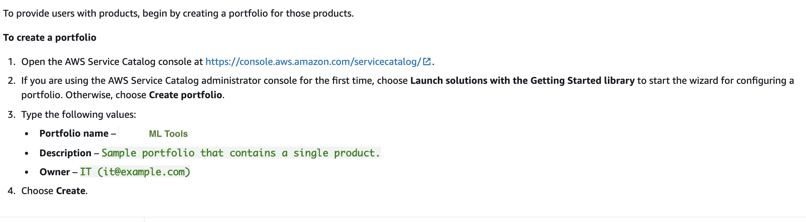
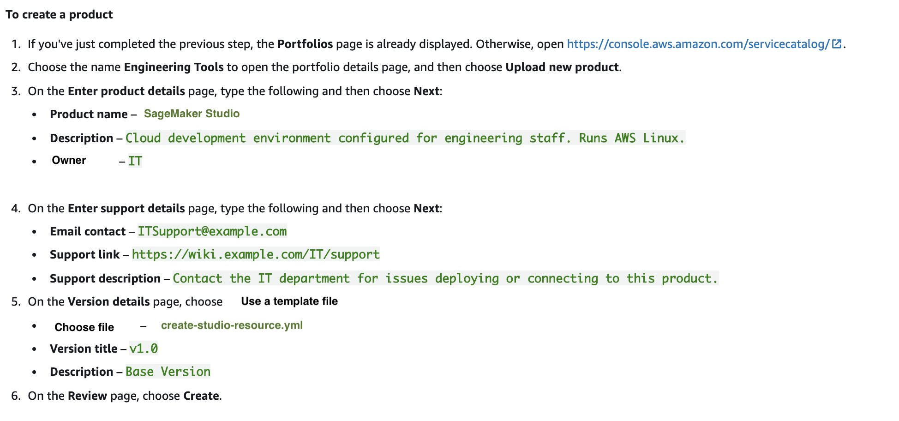

# Provision self-service, governed ML development environments 

## Introduction

In this lab, we will use AWS Service Catalog to enable secure, self-service provisioning of Amazon SageMaker Studio. Service Catalog's "Launch Constraint" feature allows provisioning of AWS resources by giving developers and data scientists either minimum or no IAM permissions to underlying AWS services. Governed access through AWS Service Catalog enables a better security posture. AWS Service Catalog also allows the centralized infrastructure team to enforce configuration standards across AWS services, while granting development teams the flexibility to customize AWS resources by using parameters at launch time.

The following diagram shows how AWS Service Catalog ensures two separate workflows for cloud system administrators and data scientists or developers who work with Amazon SageMaker.


Below are the tasks required to add a product to a portfolio and distribute it to the end user. You can also 

1. Download the AWS CloudFormation Template
2. Create an AWS Service Catalog Portfolio
3. Create an AWS Service Catalog Product
4. Add a Template Constraint to Limit Instance Size
5. Add a Launch Constraint to Assign an IAM Role
6. Grant End Users Access to the Portfolio
7. Discover and launch the Amazon SageMaker Studio 

### <b>Prerequisite: Create the lambda function using the studio.zip</b>

Navigate to the "studio" folder using the terminal on the SageMaker notebook instance. Using the following aws cli command, create the custom function that creates the studio resource

```
aws lambda create-function \
    --function-name "crhelper-studio-resource" \
    --handler "lambda_function.handler" \
    --timeout 900 \
    --zip-file fileb://./studio.zip \
    --runtime python3.7 \
    --role "arn:aws:iam::{ReplaceAccountNumberHere}:role/mlops-customerchurn-sagemaker-role"\
    --region us-west-2

```

### <b>Step 1: Download the AWS CloudFormation Template</b>
In the SageMaker Notebook Instance that was created as part of the MLOps Stack, using the jupyter inteface download the create-studio-resource.yml file from the "studio" folder to your local machine. 

### <b>Step 2: Create an AWS Service Catalog Portfolio</b>


### <b>Step 3: Create an AWS Service Catalog Product</b>



### <b>Step 4: Add a Template Constraint to Limit Instance Size</b>

On the portfolio details page, expand the Constraints section, and choose Add constraints.

In the Select product and type window, for Product, choose the product you created. Then, for Constraint type, choose Template 

Choose Continue

For Description, type "limit instace size"

Paste the following into the Template constraint text box and "Submit"

```
{
    "Rules": {
      "Rule1": {
        "Assertions": [
          {
            "Assert" : {"Fn::Contains": [["ml.t3.medium", "ml.t3.large", "ml.m5.large", "ml.c5.large"], {"Ref": "InstanceType"}]},
            "AssertDescription": "Instance type should be t3.medium, t3.large,m5.large or c5.large"
          }
        ]
      }
    }
  }

```

### <b>Step 5: Add a Launch Constraint to Assign an IAM Role</b>

Open the IAM console, In the navigation pane, choose Policies. Choose Create policy and do the following:

On the Create policy page, choose the JSON tab

Copy the following example policy and paste it in Policy Document, replacing the placeholder JSON in the text field:


```
{
    "Version": "2012-10-17",
    "Statement": [
        {
            "Effect": "Allow",
            "Action": [
                "cloudformation:CreateStack",
                "cloudformation:DeleteStack",
                "cloudformation:DescribeStackEvents",
                "cloudformation:DescribeStacks",
                "cloudformation:GetTemplateSummary",
                "cloudformation:SetStackPolicy",
                "cloudformation:ValidateTemplate",
                "cloudformation:UpdateStack",
                "ec2:*",
                "s3:GetObject",
                "servicecatalog:*",
                "sns:*",
                "lambda:*"
            ],
            "Resource": "*"
        }
    ]
}


```

a. Choose Review policy

b. For Policy Name, type "studio-launch-policy"

c. Choose Create policy

In the navigation pane, choose Roles. Choose Create role and do the following:

a. For Select role type, choose AWS service and then choose Service Catalog. Select the Service Catalog use case and then choose then choose Next: Permissions

b. Search for the studio-launch-policy policy and then select the checkbox

c. Choose Next: Tags, and then Next: Review

d. For Role name, type studio-launch-role

e. Choose Create role


Open the AWS Service Catalog console, choose the created portfolio

On the portfolio details page, choose the Constraints tab, and then choose Create constraint

Select the product, and for Constraint type, choose Launch. Choose Continue

On the Launch constraint page, choose Search IAM roles, choose studio-launch-role, and then choose Submit

### <b>Step 6: Grant End Users Access to the Portfolio </b>
Now that you have created a portfolio and added a product, you are ready to grant access to end users.

Prerequisites:

If you haven't created an IAM group for the endusers, see  [Grant Permissions to AWS Service Catalog End Users](https://docs.aws.amazon.com/servicecatalog/latest/adminguide/getstarted-iamenduser.html). For this lab, we will use the "TeamRole" that has the permissions


### <b>Step 7: Discover and launch the Amazon SageMaker Studio </b>

To verify that the end user can access the end user console, you will need to login as that user and access the service catalog console to launch the product. 
For this lab, we will access the product by clicking on the product link. Click on the "Studio" product and click "Launch Product"


